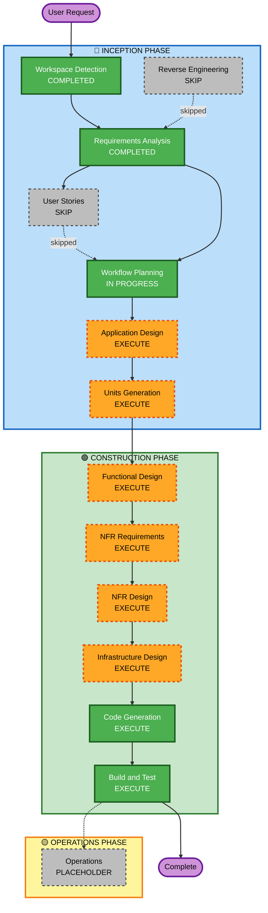

# Execution Plan

## Detailed Analysis Summary

### Change Impact Assessment
- **User-facing changes**: Yes — Webアプリ（ログイン、ロケーション入力、画像生成UI、Google Photo保存）
- **Structural changes**: Yes — 新規プロジェクト。フロントエンド・バックエンド・外部API連携の複数コンポーネント構成
- **Data model changes**: Yes — ユーザープロフィール、ロケーション履歴のDynamoDBスキーマ設計が必要
- **API changes**: Yes — バックエンドAPI新規設計（画像生成エンドポイント、Google Photos連携エンドポイント）
- **NFR impact**: Yes — 画像生成120秒以内、ページロード5秒以内、Google OAuth認証

### Risk Assessment
- **Risk Level**: Medium
- **Rollback Complexity**: Easy（新規プロジェクトのため）
- **Testing Complexity**: Moderate（外部API連携が複数あるため）

---

## Workflow Visualization



### テキスト表現（代替）
```
INCEPTION PHASE:
  [x] Workspace Detection    - COMPLETED
  [-] Reverse Engineering    - SKIP（グリーンフィールド）
  [x] Requirements Analysis  - COMPLETED
  [-] User Stories           - SKIP（シンプルなPoC）
  [>] Workflow Planning      - IN PROGRESS
  [ ] Application Design     - EXECUTE
  [ ] Units Generation       - EXECUTE

CONSTRUCTION PHASE:
  [ ] Functional Design      - EXECUTE
  [ ] NFR Requirements       - EXECUTE
  [ ] NFR Design             - EXECUTE
  [ ] Infrastructure Design  - EXECUTE
  [ ] Code Generation        - EXECUTE (ALWAYS)
  [ ] Build and Test         - EXECUTE (ALWAYS)

OPERATIONS PHASE:
  [-] Operations             - PLACEHOLDER
```

---

## Phases to Execute

### 🔵 INCEPTION PHASE
- [x] Workspace Detection — COMPLETED
- [-] Reverse Engineering — **SKIP**
  - **Rationale**: グリーンフィールドプロジェクトのため不要
- [x] Requirements Analysis — COMPLETED
- [-] User Stories — **SKIP**
  - **Rationale**: 単一ユーザー（個人利用）のPoC。ユーザーペルソナや受け入れ基準の詳細化より実装優先
- [>] Workflow Planning — IN PROGRESS
- [ ] Application Design — **EXECUTE**
  - **Rationale**: 新規プロジェクトで複数コンポーネント（フロントエンド、バックエンドAPI、AI画像生成サービス、Google Photos連携）が必要。コンポーネント境界・インターフェース設計が必要
- [ ] Units Generation — **EXECUTE**
  - **Rationale**: フロントエンド・バックエンド・インフラの複数ユニットに分解が必要。並行開発の単位を明確化する

### 🟢 CONSTRUCTION PHASE
- [ ] Functional Design — **EXECUTE**
  - **Rationale**: AI画像生成ロジック、Google Photos連携、ロケーション処理など複数の業務ロジックの詳細設計が必要
- [ ] NFR Requirements — **EXECUTE**
  - **Rationale**: 画像生成の非同期処理、Google OAuth認証、AWS Lambda/DynamoDBの技術スタック選定が必要
- [ ] NFR Design — **EXECUTE**
  - **Rationale**: NFR要件（120秒以内の非同期処理、5秒ページロード）を実装パターンに落とし込む設計が必要
- [ ] Infrastructure Design — **EXECUTE**
  - **Rationale**: AWS Lambda + API Gateway + DynamoDB + S3 の構成設計が必要
- [ ] Code Generation — **EXECUTE**（ALWAYS）
  - **Rationale**: 実装計画とコード生成
- [ ] Build and Test — **EXECUTE**（ALWAYS）
  - **Rationale**: ビルド・テスト・検証

### 🟡 OPERATIONS PHASE
- [-] Operations — PLACEHOLDER

---

## Success Criteria
- **Primary Goal**: ロケーション入力 → AI画像生成 → Google Photo保存の一連のフローが動作すること
- **Key Deliverables**:
  - Next.js フロントエンド（ロケーション入力UI、画像プレビュー）
  - バックエンドAPI（画像生成エンドポイント、Google Photos連携）
  - AWS インフラ構成（Lambda, API Gateway, DynamoDB, S3）
  - Google OAuth 2.0 認証フロー
- **Quality Gates**:
  - Google OAuth ログインが動作すること
  - ロケーション入力からAI画像生成が完了すること
  - 生成画像がGoogle Photoアルバムに保存されること
